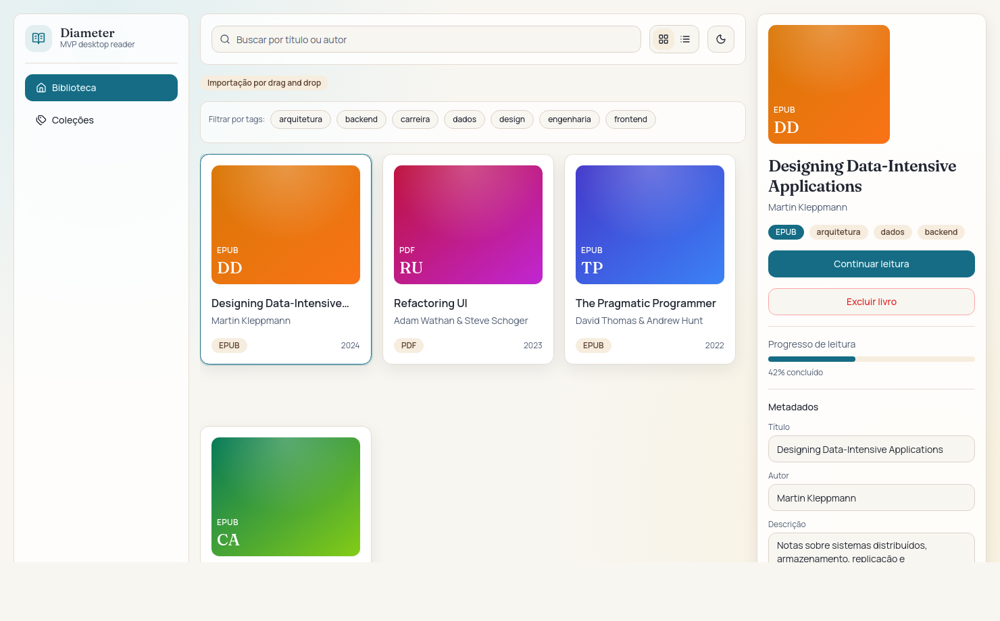
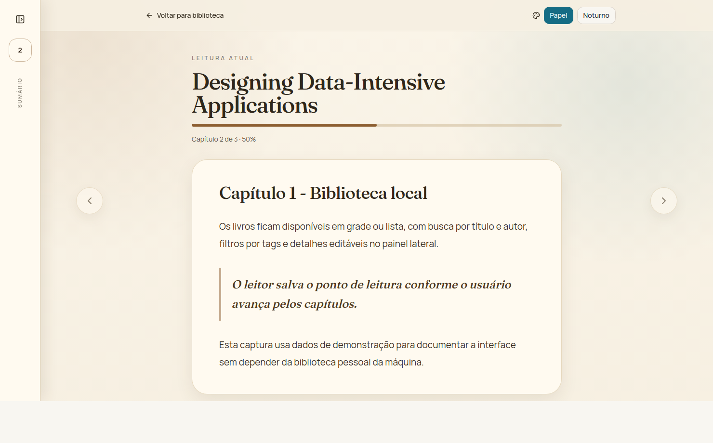

# Diameter

Diameter é um leitor desktop para organizar uma biblioteca local de ebooks. O app foi construído como um MVP em Tauri, com interface React e backend Rust para persistência, importação de arquivos e leitura de EPUB.



## Funcionalidades

- Biblioteca local com visualização em grade ou lista.
- Importação por drag and drop de arquivos EPUB e PDF.
- Busca por título ou autor e filtro por tags.
- Painel lateral com capa, formato, progresso, tags e metadados editáveis.
- Exclusão de livros importados.
- Leitor EPUB integrado com navegação por capítulos, tema papel/noturno e salvamento de progresso.
- Persistência local em SQLite.



## Stack

- Tauri 2 para empacotamento desktop e integração com APIs nativas.
- Rust no backend, com `rusqlite` para banco local, `zip`/`roxmltree` para processamento de EPUB e `base64` para capas.
- React 19 + TypeScript no frontend.
- Vite 8 para desenvolvimento e build do frontend.
- Tailwind CSS para estilos.
- Lucide React para iconografia.

## Como rodar

Instale as dependências:

```bash
npm install
```

Rode apenas o frontend:

```bash
npm run dev
```

Rode o aplicativo desktop com Tauri:

```bash
npm run tauri dev
```

Gere o build do frontend:

```bash
npm run build
```

Execute o lint:

```bash
npm run lint
```

## Estrutura

- `src/`: interface React, componentes de layout, leitor EPUB e camada de chamada dos comandos Tauri.
- `src-tauri/`: aplicação Tauri em Rust, comandos, banco SQLite, importação de arquivos e parser EPUB.
- `docs/screenshots/`: capturas usadas neste README.

## Observações

A leitura integrada está disponível para EPUB. Arquivos PDF podem ser importados e catalogados, mas ainda não têm leitor interno nesta fase do projeto.
